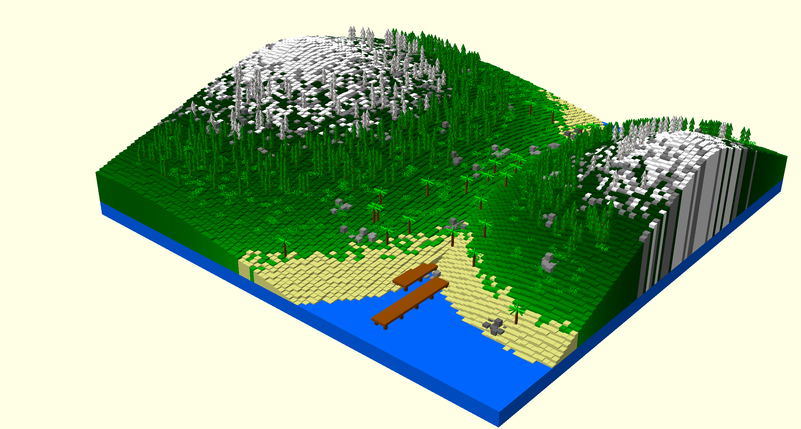
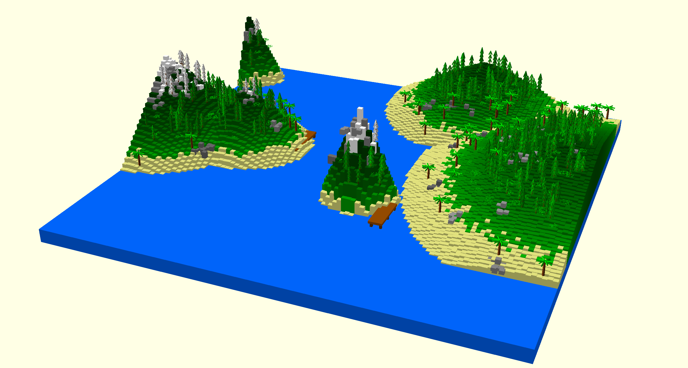
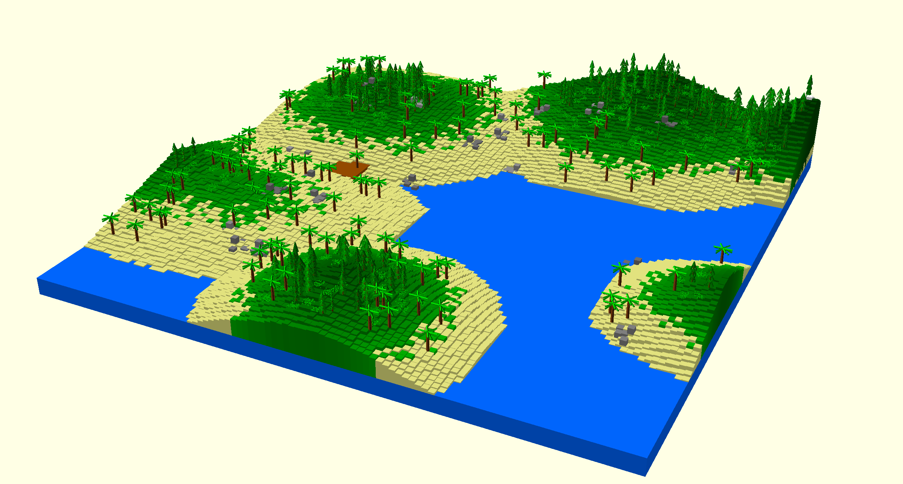
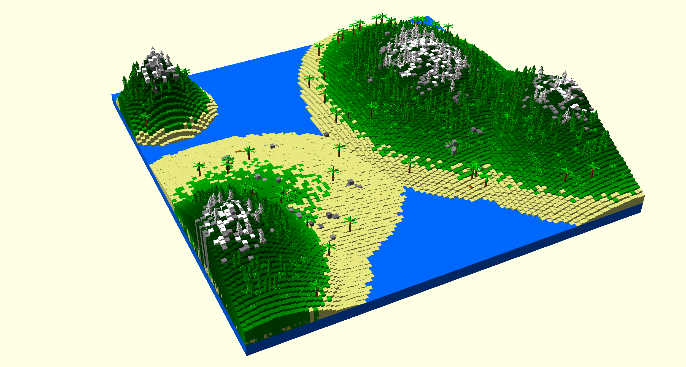

# 🌍 Procedural Terrain Generator for OpenSCAD

This project is a **procedural 3D terrain generator** written in Python that creates randomized landscapes using **OpenSCAD**. It simulates islands, trees (pine and palm), bushes, rocks, and docks, all generated with natural-looking variation and logic based on elevation and randomness.

Each time you run the script, a unique landscape is generated and saved as an OpenSCAD file (`generated_landscape.scad`) which can be previewed, rendered, and exported to STL for 3D printing or modeling.

## 📸 Example Output






## 🧰 Features

- 🏝️ **Random island generation** with proportional scaling based on terrain size and island count
- 🌲 **Pine trees** with realistic trunk tapering, randomized foliage, and leaf layering
- 🌴 **Palm trees** with multi-directional leaf sets and organic curvature
- 🌿 **Bushes** built from particle clusters to mimic natural shape
- 🪨 **Rock formations** with randomized clusters and grayscale shading
- 🚤 **Docks** generated near water level, placed sparsely and logically
- ❄️ Biome-sensitive coloration (snow at high altitudes, grass, rock, and sand gradients)

## 🛠 Requirements

- **Python 3.x**
- **NumPy**

Install dependencies:

```bash
pip install numpy
```

- **OpenSCAD** – [Download here](https://openscad.org/)  
  Required to open and render the generated `.scad` files.

## 🚀 How to Use

1. **Clone or download** the repository:

```bash
git clone https://github.com/lpostiguy/procedural-terrain-generator.git
cd procedural-terrain-generator
```

2. **Run the generator script**:

```bash
python terrain_generator.py
```

3. **Open the output file** in OpenSCAD:

```bash
generated_landscape.scad
```

4. **Render (F6)** in OpenSCAD to view the full terrain.  
   You can then **export to STL** or other supported formats.

## ⚙️ Configuration Options

You can adjust terrain generation behavior by modifying parameters at the top of the script:

```python
size_x = 100         # Width of the terrain
size_y = 100         # Depth of the terrain
ocean_height = 3     # Base ocean elevation
max_height = 25      # Maximum terrain height
num_islands = 7      # Number of islands to generate
tree_height = 3      # Base pine tree height
rock_height = 1      # Base rock height
```

Additionally, tree, island, and feature variability is handled automatically using randomized offsets, noise, and scaling.

## 📁 Project Structure

```
/procedural-terrain-generator/
│
├── terrain_generator.py      # Main Python script
├── generated_landscape.scad  # Output OpenSCAD file
└── README.md                 # Project documentation
```

## 🧠 How It Works

- Terrain is represented as a grid (size_x × size_y).
- Each island has a random center point and radius, with height decreasing from center outward.
- Features like trees, bushes, and docks are placed based on **elevation rules** and **random rarity chances**.
- Output is plain OpenSCAD code using primitives: `cube()`, `cylinder()`, `translate()`, `rotate()`, etc.
- Simple height-based biome logic assigns **colors** for sand, grass, rock, and snow zones.

## 🧪 Future Ideas

- 🌋 Volcanic terrain or mountains
- ⛺ Player structures or cabins
- 🐾 Fauna or movement simulation
- ⛅ Sky and lighting improvements in OpenSCAD
- GUI for easier parameter control

## 📄 License

This project is open-source under the **MIT License**.  
Feel free to modify, distribute, and use it however you like.

## 🙌 Credits

Created by Louis-Philippe Ostiguy
Inspired by terrain generators, Minecraft, and OpenSCAD's simplicity.

## 💬 Feedback

If you have ideas, improvements, or questions, feel free to open an issue or start a discussion!
